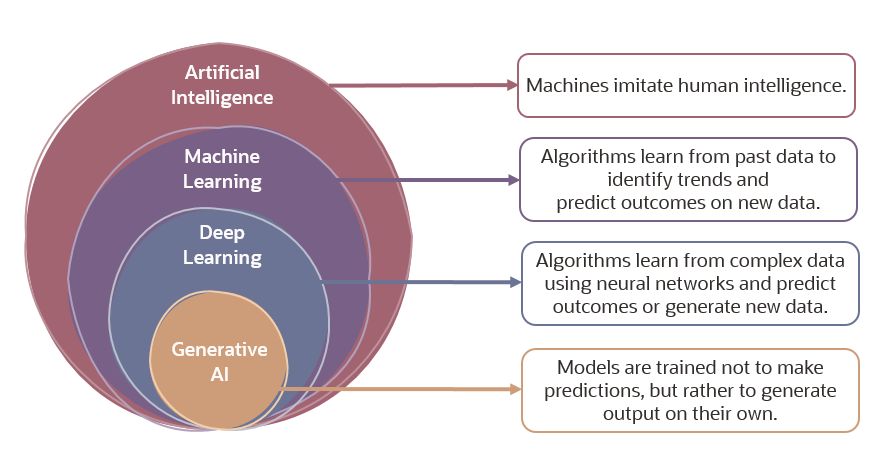

## Tipos de IA

Simplificando, a Inteligência Artificial é um software que imita comportamentos e capacidades humanas. As principais cargas de trabalho incluem:

- [**Machine Learning ML (Aprendizado de Máquina)**](): Esta é frequentemente a base para um sistema de IA e é a forma como "ensinamos" um modelo de computador a fazer previsões e tirar conclusões a partir de dados.

- [**Computer Vision Visão Computacional**](): Capacidades dentro da IA para interpretar o mundo visualmente através de câmeras, vídeos e imagens.

- [**Natural Language Processing NLP Processamento de linguagem natural**]() - Capacidades dentro da IA para um computador interpretar linguagem escrita ou falada e responder de forma semelhante.

- [**Document Intelligence (Inteligência de Documentos)**](): Capacidades dentro da IA que lidam com a gestão, processamento e uso de grandes volumes de dados encontrados em formulários e documentos.

- [**Knowledge Mining (Mineração de conhecimento)**](): Capacidades dentro da IA para extrair informações de grandes volumes de dados, muitas vezes não estruturados, para criar um repositório de conhecimento pesquisável.

- [**Generative AI (IA generativa)**](): Capacidades dentro da IA de criar conteúdo "original" em uma variedade de formatos, incluindo linguagem natural, imagem, código e muito mais.

 

## Princípios de implementação de uma IA

Os seis princípios de uma Inteligência Artificial (IA) responsável são fundamentais para garantir que os sistemas de IA sejam desenvolvidos e utilizados de maneira ética e justa. Abaixo, os princípios são detalhados e exemplificados:

- **Fairness (Justiça)**: Os sistemas de IA devem tratar todas as pessoas de forma justa. Por exemplo, ao criar um modelo de aprendizado de máquina para apoiar a aprovação de empréstimos em um banco, o modelo deve prever a aprovação ou rejeição do empréstimo sem quaisquer vieses. Esse viés pode estar relacionado a gênero, etnia ou outros fatores que resultem em uma vantagem ou desvantagem injusta para grupos específicos de candidatos

- **Reliability and Safety (Confiabilidade e Segurança)**: Os sistemas de IA devem operar de maneira confiável e segura. Por exemplo, considere um sistema de software baseado em IA para um veículo autônomo ou um modelo de aprendizado de máquina que diagnostica sintomas de pacientes e recomenda prescrições. A falta de confiabilidade nesses sistemas pode resultar em riscos substanciais para a vida humana

- **Privacy and Security (Privacidade e Segurança)**: Os sistemas de IA devem ser seguros e respeitar a privacidade. Os modelos de aprendizado de máquina, nos quais os sistemas de IA são baseados, dependem de grandes volumes de dados que podem conter detalhes pessoais que devem ser mantidos em sigilo. Mesmo após o treinamento dos modelos e a entrada em produção do sistema, a privacidade e a segurança precisam ser consideradas. À medida que o sistema utiliza novos dados para fazer previsões ou tomar decisões, tanto os dados quanto as decisões podem estar sujeitos a preocupações de privacidade ou segurança

- **Inclusiveness (Inclusão)**: Os sistemas de IA devem capacitar e engajar a todos, trazendo benefícios para todas as partes da sociedade, independentemente da capacidade física, gênero, orientação sexual, etnia ou outros fatores

- **Transparency (Transparência)**: Os sistemas de IA devem ser compreensíveis. Os usuários devem estar totalmente cientes da finalidade do sistema, de como ele funciona e das limitações que podem ser esperadas

- **Accountability (Responsabilidade)**: As pessoas devem ser responsáveis pelos sistemas de IA. Designers e desenvolvedores de soluções baseadas em IA devem trabalhar dentro de um quadro de governança e princípios organizacionais que garantam que a solução atenda a padrões éticos e legais claramente definidos